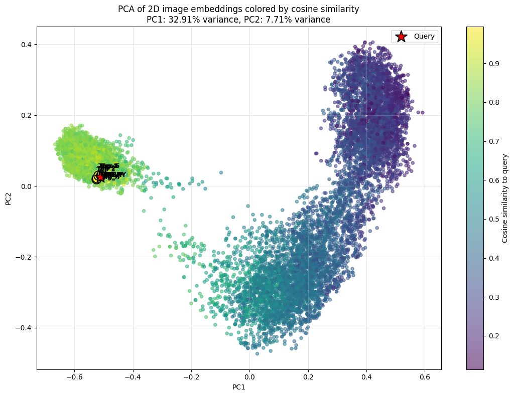
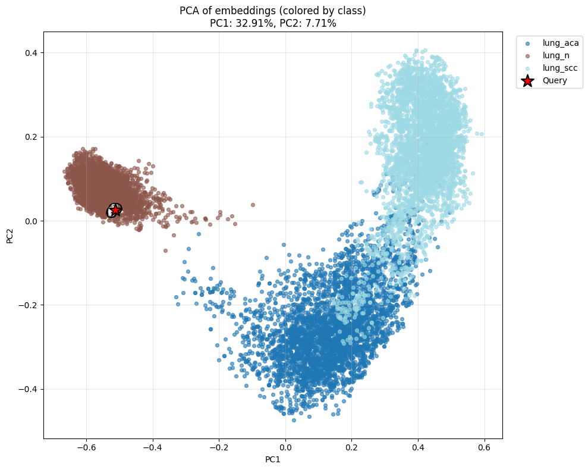
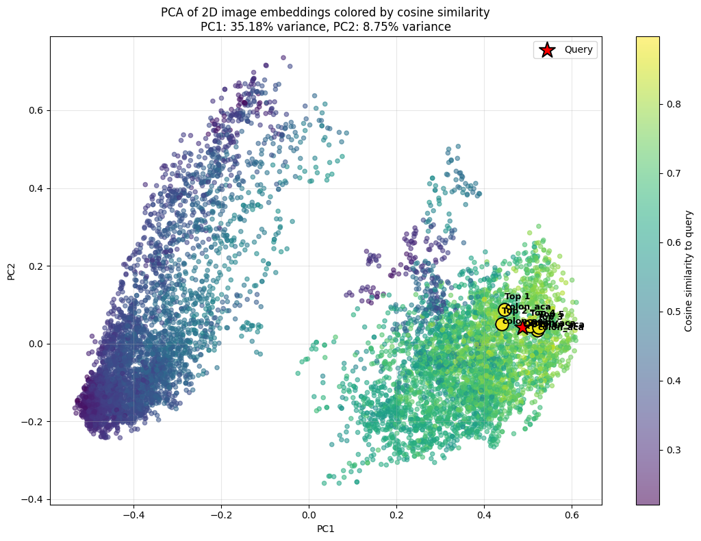
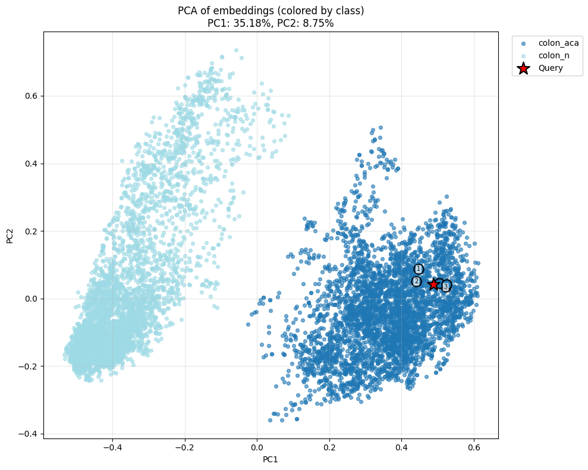
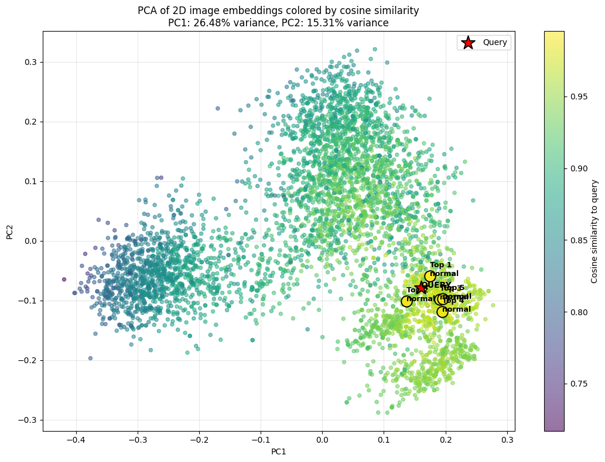
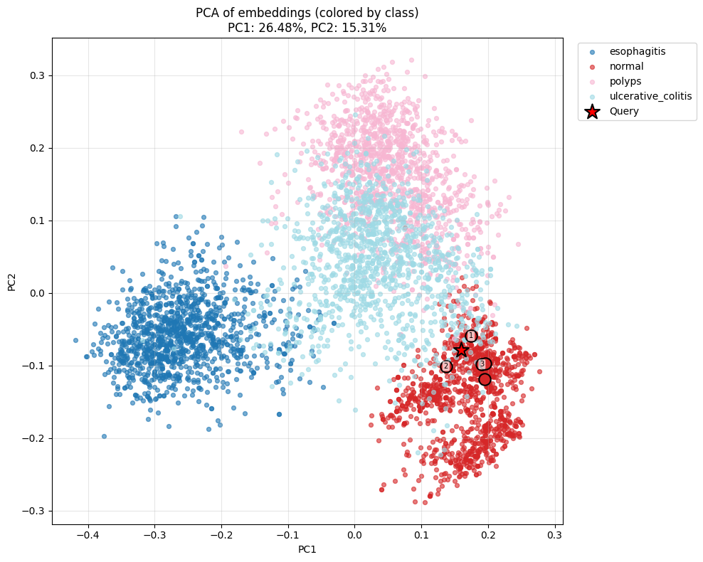
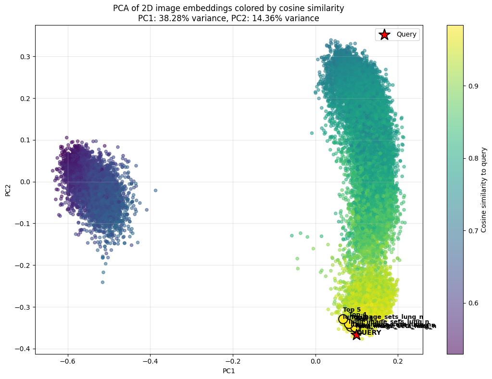
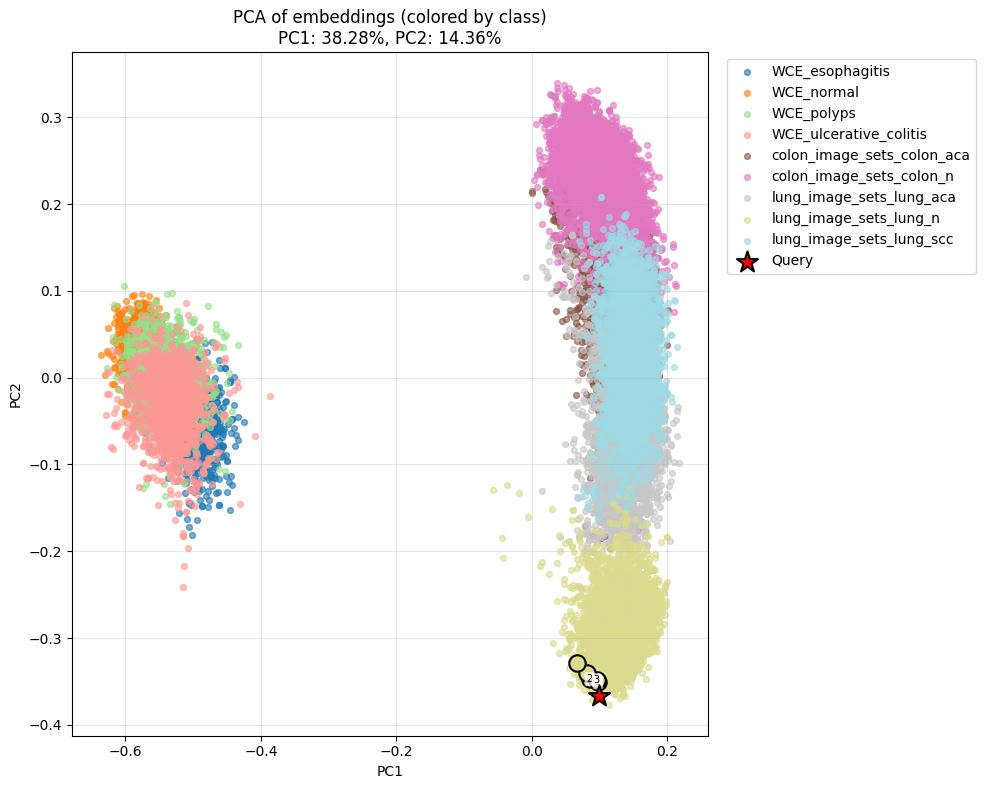

# CBIR-in-Histopathology-and-Gastrointestinal-Endoscopy-A-Comparative-Study-of-Deep-Models

This project benchmarks multiple pretrained vision backbones for **2D image retrieval** on a folder-structured histopathology dataset. The pipeline builds embeddings for train and test splits, retrieves the most similar training images for each test image, evaluates class-consistent retrieval, saves all outputs, and provides PCA-based visualization utilities for inspecting the embedding space.

## Overview

The code is written in **PyTorch** and uses model ecosystems from **timm**, **Hugging Face Transformers**, **OpenCLIP**, and **Segment Anything**. The benchmark compares standard computer-vision encoders, vision-language encoders, and medical-domain foundation models in a unified retrieval workflow. `timm` exposes pretrained vision models through `create_model`, Transformers provides model wrappers such as `SamModel`, OpenCLIP is an open-source CLIP implementation, and UNI is distributed through Mahmood Lab with Hugging Face-gated access. 

## What the code does

Given a dataset organized by class folders, the script:

1. Scans all images under each class directory.
2. Builds a **stratified 80/20 train-test split**.
3. Extracts normalized embeddings for the training set and test set.
4. Uses cosine similarity to retrieve the **top-k nearest training images** for each test image.
5. Evaluates retrieval performance with **Precision@K**, **HitRate@K**, **Recall@K**, **mAP**, and **MRR**.
6. Saves metadata CSV files, embedding `.npy` files, retrieval examples, and a summary comparison file.
7. Visualizes retrieval examples and PCA projections of the learned embedding space.

## Supported backbones

Your code benchmarks the following backbones:

- `resnet50`
- `vit_b16`
- `swin_b`
- `clip_vit_l14`
- `biomedclip`
- `dinov2_vitb14`
- `mae_vit_b16`
- `bmc_clip_cf`
- `sam_vit_b`
- `medsam_vit_b`
- `siglip`
- `medsiglip`
- `uni`
- `openclip_vit_h14`

Several of these correspond to official released model families: CLIP on Hugging Face, BiomedCLIP from Microsoft, DINOv2 from Meta/Facebook Research, SAM from Meta, MedSAM from Bowang Lab, SigLIP from Google, MedSigLIP from Google Health, UNI from Mahmood Lab, and OpenCLIP from mlfoundations. 

## Dataset format

The dataset is expected to follow this layout:

```text
dataset_root/
├── class_a/
│   ├── image1.jpg
│   ├── image2.png
│   └── ...
├── class_b/
│   ├── image3.jpg
│   └── ...
└── ...
```

## Datasets

The datasets can be accessed at the following link: [Download Datasets](https://drive.google.com/drive/folders/1K7v9Oqdy9DShtzX31pNFMYdjWWCMb5hM?usp=sharing)

Each subdirectory name is treated as the class label. The code accepts common image formats including JPG, JPEG, PNG, BMP, TIF, TIFF, and WEBP.

## Retrieval metrics

The benchmark reports the following retrieval metrics:

- **Precision@K**: fraction of retrieved items in the top-k that match the query class.
- **HitRate@K**: whether at least one correct match appears in the top-k.
- **Recall@K**: fraction of all relevant gallery items recovered in the top-k.
- **mAP**: mean average precision over all queries.
- **MRR**: mean reciprocal rank of the first correct match.

## Installation

Install the required dependencies with:

```bash
pip install open_clip_torch
pip install -q timm transformers nibabel open_clip_torch segment-anything huggingface_hub
pip install pillow scikit-learn matplotlib pandas numpy
```

These packages correspond to the libraries used by the benchmark: `timm` for pretrained vision models, `transformers` for model wrappers such as CLIP and SAM, `open_clip_torch` for OpenCLIP-based models, `segment-anything` for repository-based SAM and MedSAM loading, and `huggingface_hub` for downloading hosted checkpoints. 

## Colab usage

The notebook is designed to run cleanly in **Google Colab**, with data and checkpoints copied from Google Drive before execution. In Colab, mounting Drive allows the runtime to access datasets and local checkpoints stored under `MyDrive`. Google Colab notebooks are hosted on `colab.research.google.com`, which is also where your original notebook link points.

## Model-specific notes

### CLIP ViT-L/14

The code uses `openai/clip-vit-large-patch14`, a Hugging Face CLIP model based on the CLIP family.

### BiomedCLIP

BiomedCLIP is a biomedical vision-language foundation model from Microsoft pretrained on PMC-15M figure-caption pairs from PubMed Central.

### DINOv2

The benchmark loads DINOv2 with `torch.hub.load("facebookresearch/dinov2", "dinov2_vitb14")`, which matches the official DINOv2 repository examples. DINOv2 is presented as a vision foundation model for image-feature extraction and downstream visual tasks. 

### MAE ViT-B/16

The `vit_base_patch16_224.mae` checkpoint in timm is documented as a Vision Transformer pretrained on ImageNet-1k using the self-supervised Masked Autoencoder method. 

### SAM ViT-B

Segment Anything Model (SAM) is a promptable segmentation model that can generate masks from prompts such as points or boxes, and the official repository states it was trained on 11 million images and 1.1 billion masks. The Transformers documentation also provides a `SamModel` wrapper.

### MedSAM ViT-B

MedSAM is the medical-imaging adaptation of Segment Anything released by Bowang Lab, and the official repository identifies itself as the repository for “MedSAM: Segment Anything in Medical Images.”

### SigLIP

SigLIP is documented by Hugging Face as a multimodal image-text model similar to CLIP, and the Google model card describes it as replacing the softmax-style contrastive objective with a sigmoid loss over image-text pairs. 

### MedSigLIP

MedSigLIP is a Google Health model for encoding medical images and text into a shared embedding space, and the model card states it supports **448×448** image resolution. 

### UNI

UNI is a pathology foundation model from Mahmood Lab. The Hugging Face model page describes it as a pretrained histopathology vision encoder, and the official repository notes that users must authenticate with Hugging Face and request access to the model weights. 

### OpenCLIP ViT-H/14

OpenCLIP is an open-source implementation of CLIP maintained by mlfoundations, and Hugging Face documents OpenCLIP as an open-source CLIP implementation available on the Hub. 

## Output files

For each backbone, the script creates a separate output directory containing:

- `train_index.csv`
- `train_embeddings.npy`
- `test_index.csv`
- `test_embeddings.npy`
- `retrieval_examples.csv`

At the top level, it also writes:

- `retrieval_comparison_summary.csv`

The code also optionally zips the entire `retrieval_outputs_2d/` folder for export.

## Visualization utilities

Your notebook includes two PCA-based analysis helpers:

1. **PCA colored by cosine similarity to the query**, highlighting retrieved nearest neighbors.
2. **PCA colored by class**, showing how the gallery distribution clusters by class and where the retrieved items lie.

These utilities are useful for qualitative inspection of whether a backbone separates classes well in embedding space.

## Results

### Lung (UNI)



### Colon (UNI)



### WCE (BMC-CLIP-CF)



### Merged datasets (BMC-CLIP-CF)



## Example configuration

```python
DATASET_ROOT = "/content/lung_image_sets"
RESULTS_DIR = "./retrieval_outputs_2d"
IMAGE_SIZE = 224
TOP_KS = (1, 5, 10)
BATCH_SIZE = 32
NUM_WORKERS = 2
EMBED_DIM = 512
USE_BFLOAT16 = True
RANDOM_SEED = 42
SHOW_RESULTS = True
NUM_EXAMPLE_QUERIES = 5
```

The code also adapts preprocessing per backbone. In particular, CLIP-family and OpenCLIP-family models use CLIP-style normalization, while timm, DINOv2, SAM-family, and UNI paths are handled with ImageNet-style normalization in your implementation.

## Reproducibility

The script sets seeds for Python, NumPy, and PyTorch to improve reproducibility across runs. It also disables gradient computation for backbone encoders during embedding extraction and normalizes output embeddings to unit length before retrieval.

## Limitations

- The evaluation treats retrieval as **class-consistency retrieval**, not instance-level relevance.
- Some models require extra setup, local checkpoints, or gated access.
- Retrieval quality can depend strongly on the resize policy and the chosen embedding projection size.
- PCA provides only a 2D approximation of the full embedding geometry.

## Citation

```bibtex
@article{radford2021clip,
  title={Learning Transferable Visual Models From Natural Language Supervision},
  author={Radford, Alec and Kim, Jong Wook and Hallacy, Chris and others},
  journal={ICML},
  year={2021}
}

@article{ilharco2021openclip,
  title={OpenCLIP: Reproducible scaling laws for contrastive language-image learning},
  author={Ilharco, Gabriel and Wortsman, Mitchell and others},
  year={2021},
  note={https://github.com/mlfoundations/open_clip}
}

@article{zhang2023biomedclip,
  title={BiomedCLIP: A Multimodal Biomedical Foundation Model Pretrained from Fifteen Million Scientific Image-Text Pairs},
  author={Zhang, Sheng and others},
  journal={arXiv preprint arXiv:2303.00915},
  year={2023}
}

@article{oquab2023dinov2,
  title={DINOv2: Learning Robust Visual Features without Supervision},
  author={Oquab, Maxime and Darcet, Timothée and others},
  journal={arXiv preprint arXiv:2304.07193},
  year={2023}
}

@article{he2022mae,
  title={Masked Autoencoders Are Scalable Vision Learners},
  author={He, Kaiming and Chen, Xinlei and Xie, Saining and Li, Yanghao and Doll{\'a}r, Piotr and Girshick, Ross},
  journal={CVPR},
  year={2022}
}

@article{kirillov2023sam,
  title={Segment Anything},
  author={Kirillov, Alexander and Mintun, Eric and others},
  journal={arXiv preprint arXiv:2304.02643},
  year={2023}
}

@article{mahmood2023medsam,
  title={MedSAM: Segment Anything in Medical Images},
  author={Ma, Jun and He, Yuting and others},
  journal={arXiv preprint arXiv:2304.12306},
  year={2023}
}

@article{zhai2023siglip,
  title={Sigmoid Loss for Language Image Pre-Training},
  author={Zhai, Xiaohua and Mustafa, Basil and others},
  journal={ICCV},
  year={2023}
}

@article{medsiglip2024,
  title={MedSigLIP: Medical Adaptation of SigLIP Models},
  author={Google Research},
  year={2024},
  note={https://huggingface.co/google/medsiglip-448}
}

@article{chen2024uni,
  title={UNI: A Unified Foundation Model for Pathology},
  author={Chen, Richard J. and others},
  journal={Nature Medicine},
  year={2024}
}

@article{rw2019timm,
  title={PyTorch Image Models (timm)},
  author={Wightman, Ross},
  year={2019},
  note={https://github.com/rwightman/pytorch-image-models}
}

@article{wolf2020transformers,
  title={Transformers: State-of-the-Art Natural Language Processing},
  author={Wolf, Thomas and Debut, Lysandre and others},
  journal={EMNLP},
  year={2020}
}
```

## Acknowledgments

We would like to express our sincere gratitude to the researchers, engineers, and open-source contributors behind the models and libraries used in this benchmark. This work builds upon a rich ecosystem of foundational research and publicly available tools that have significantly advanced the field of computer vision and medical imaging.

In particular, we thank the authors and contributors of CLIP, OpenCLIP, BiomedCLIP, DINOv2, MAE, Segment Anything (SAM), MedSAM, SigLIP, MedSigLIP, and UNI for making their models and pretrained weights available to the community. Their efforts have enabled large-scale comparative studies and accelerated progress in representation learning.

We also acknowledge the developers of key libraries such as PyTorch, timm, Hugging Face Transformers, OpenCLIP, and Segment Anything, whose tools made this implementation possible.

Finally, we appreciate the broader open-source community for sharing datasets, code, and ideas that continue to drive innovation in this field.
